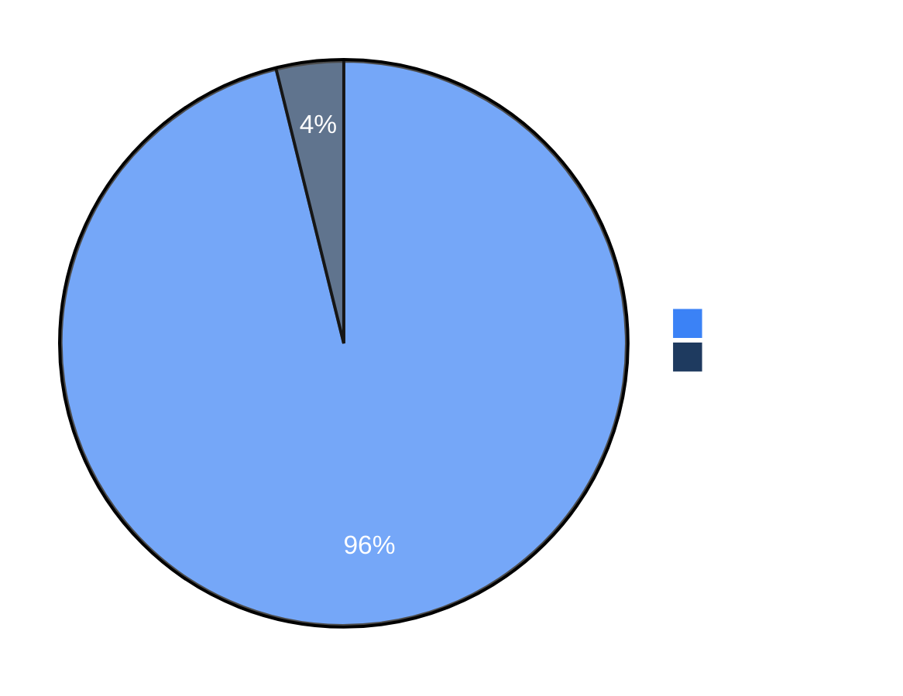

# Benchmarks

We use security benchmarks to track Strix's capabilities and improvements over time. We plan to add more benchmarks, both existing ones and our own, to help the community evaluate and compare security agents.

## Quick start

```bash
# Pre-req: export STRIX_LLM + LLM_API_KEY; Docker daemon running.
./benchmarks/run_all.sh --dry-run             # see what would run
./benchmarks/run_all.sh --suite per_target    # full agentic suite
./benchmarks/run_all.sh --suite public        # direct-tool suite
./benchmarks/run_all.sh --fixture vampi       # one fixture
./benchmarks/run_all.sh --scan-mode quick     # faster scan mode
```

Per-target results land in `benchmarks/per_target/baseline/`; direct-
tool results in `benchmarks/public/fixtures/*/baseline/`.

CI workflow: [`.github/workflows/benchmarks.yml`](../.github/workflows/benchmarks.yml)
runs the suite manually via `workflow_dispatch` or on a weekly cron.

## Fixture inventory

| Suite | Fixture | Target type | Source | Status |
|---|---|---|---|---|
| `per_target` | [`web/juiceshop`](per_target/fixtures/web/juiceshop) | web_application | OWASP Juice Shop v17.2.0 | ✅ baselined |
| `per_target` | [`api/vampi`](per_target/fixtures/api/vampi) | api | erev0s/VAmPI 0.4.3 | ✅ fixture; first run TBD |
| `per_target` | [`api/crapi`](per_target/fixtures/api/crapi) | api | OWASP crAPI 0.7.0 | ✅ fixture; first run TBD |
| `per_target` | [`code/flask-vuln`](per_target/fixtures/code/flask-vuln) | local_code | hand-built | ✅ baselined |
| `per_target` | [`web+code/vibe-app`](per_target/fixtures/web+code/vibe-app) | web_application + repository | hand-built vibe-coded SaaS | ✅ baselined |
| `public` | `sast/nodegoat` | local_code (direct-tool) | OWASP NodeGoat | ✅ baselined |
| `public` | `sca/nodegoat` | repository (direct-tool) | OWASP NodeGoat | ✅ baselined |
| `public` | `iac/dockerfile-bad-patterns` | local_code (direct-tool) | synthetic | ✅ baselined |


## Full Details

For the complete benchmark results, evaluation scripts, and run data, see the [usestrix/benchmarks](https://github.com/usestrix/benchmarks) repository.

> [!NOTE]
> We are actively adding more benchmarks to our evaluation suite.


## Results

| Benchmark | Challenges | Success Rate |
|-----------|------------|--------------|
| [XBEN](https://github.com/usestrix/benchmarks/tree/main/XBEN) | 104 | **96%** |

### XBEN

The [XBOW benchmark](https://github.com/usestrix/benchmarks/tree/main/XBEN) is a set of 104 web security challenges designed to evaluate autonomous penetration testing agents. Each challenge follows a CTF format where the agent must discover and exploit vulnerabilities to extract a hidden flag.

Strix `v0.4.0` achieved a **96% success rate** (100/104 challenges) in black-box mode.



**Performance by Difficulty:**

| Difficulty | Solved | Success Rate |
|------------|--------|--------------|
| Level 1 (Easy) | 45/45 | 100% |
| Level 2 (Medium) | 49/51 | 96% |
| Level 3 (Hard) | 6/8 | 75% |

**Resource Usage:**
- Average solve time: ~19 minutes
- Total cost: ~$337 for 100 challenges
